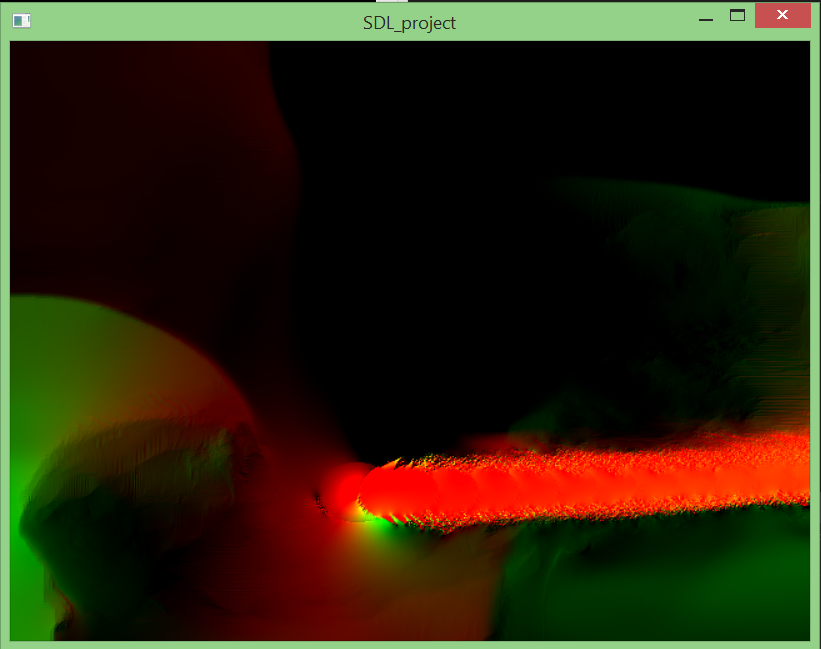
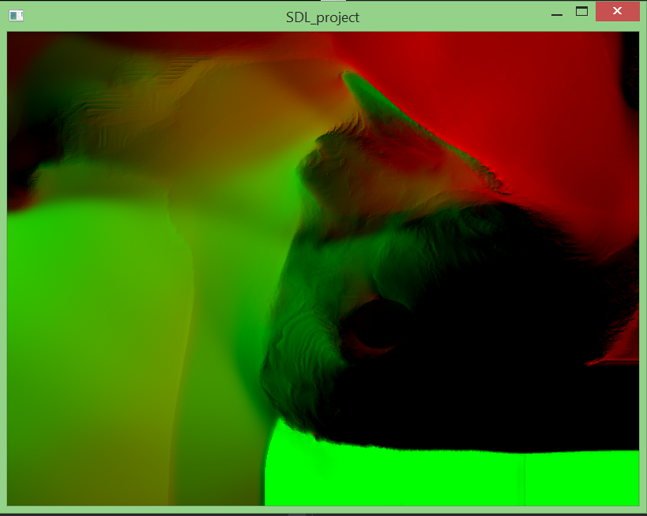

# Real time 2D fluid simulation

Project to implement real-time 2D fluid on GPU, written in **C++** using **OpenGL** based on [this](https://developer.nvidia.com/GPUGems/gpugems_ch38.html) paper.

### Dependencies

* [SDL2](http://libsdl.org/)
* [GLEW](http://glew.sourceforge.net/)
* [GLM](https://github.com/g-truc/glm/tags)

### Build instructions  
```sh
$ mkdir build
$ cd build
$ cmake ..
$ make
$ ./fluidSim
```

Currently it renders :



